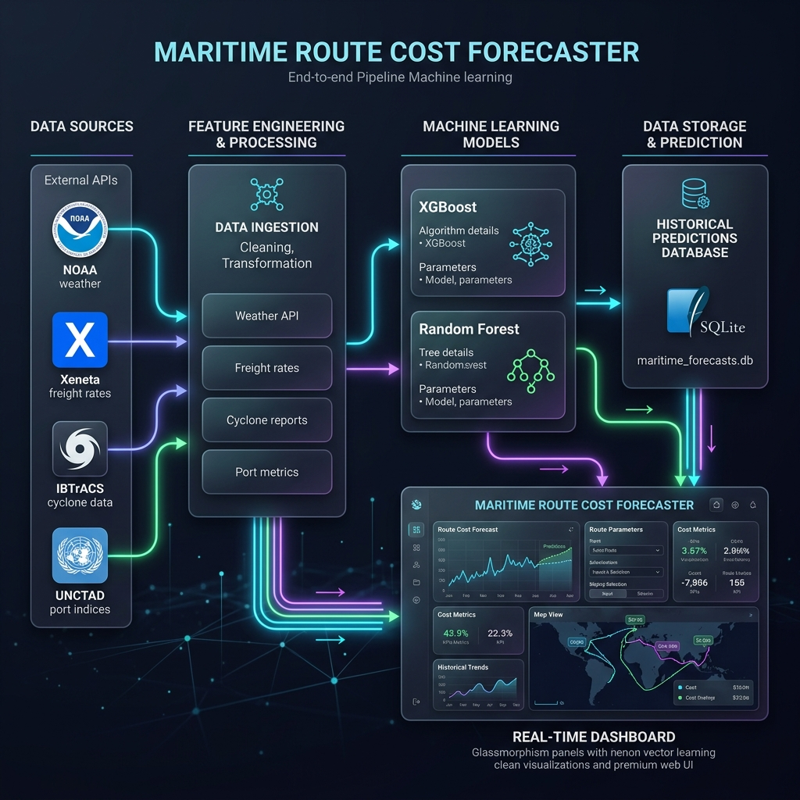

# 🌊 Maritime Route Cost Forecaster

An end-to-end Machine Learning pipeline and real-time streaming dashboard for predicting container shipping freight rates (**USD/FEU**) across **4 major global trade routes**.

---

## 📸 System Architecture

Here is the high-level system architecture of the Maritime Route Cost Forecaster pipeline and dashboard:



---

## 📌 Table of Contents
* [System Overview](#-system-overview)
* [Heterogeneous Data Sources](#-heterogeneous-data-sources)
* [Feature Engineering Pipeline](#-feature-engineering-pipeline)
* [Model Performance & Evaluation](#-model-performance--evaluation)
* [Interactive Dashboard App](#-interactive-dashboard-app)
* [Repository Structure](#-repository-structure)
* [Quick Start & Setup](#-quick-start--setup)

---

## 🌊 System Overview

The maritime shipping industry faces extreme pricing volatility driven by weather anomalies, regional economic connectivity shifts, and market momentum. This project integrates:
* **Heterogeneous Data Fusion:** Fuses raw daily freight rate benchmarks (Xeneta) with atmospheric grids (NOAA), tropical cyclone databases (IBTrACS), and port connectivity metrics (UNCTAD LSCI).
* **Geospatial Processing:** Maps coordinate-based atmospheric weather data into **9 distinct shipping transit zones**.
* **Systematic ML Sweeps:** Evaluated **160 models** across Random Forest and XGBoost architectures, using different training splits and hyperparameter sweeps.
* **Real-Time Forecasting Simulator:** Employs Server-Sent Events (SSE) and a background streamer to update an SQLite historical store and display predictions on an aesthetic, terminal-inspired frontend.

---

## 📡 Heterogeneous Data Sources

The accuracy of this forecaster relies on merging distinct, highly relevant data streams:
1. **Xeneta Shipping Index:** Daily spot rates and contract rates in USD/FEU representing the benchmark cost.
2. **NOAA Atmospheric Grids:** Vectorized wind vectors (`u-wind`, `v-wind`), precipitation, sea surface temperatures, and pressure levels.
3. **IBTrACS/JTWC Cyclones:** Raw tracks containing cyclone wind speeds, central pressures, and proximity features indicating environmental disruption risk.
4. **UNCTAD LSCI:** The Liner Shipping Connectivity Index, mapping origin and destination port infrastructure strengths to capture trade volume capacity.

---

## ⚙️ Feature Engineering Pipeline

Raw coordinate data is converted into **50+ robust features** using vectorized Pandas/xarray operations:
* **Geospatial Zone Mappings:** Translates unstructured grid points into 9 critical global shipping corridors:
  * *North Atlantic, South Atlantic, Arabian Sea, Indian Ocean, South China Sea, East China Sea, Philippine Sea, North Pacific, and South Pacific.*
* **Historical Lag Features:** Implements 7-day, 14-day, and 30-day temporal lag offsets to capture historical price levels.
* **Momentum Indication:** Rolling averages, dynamic moving standards, rate of change, and momentum vectors.
* **Environmental Threat Metrics:** Dynamic `Coastal_Threat` coefficients derived from cyclone track projections and active atmospheric hazards.

---

## 🏆 Model Performance & Evaluation

A rigorous cross-validation and hyperparameter sweep was executed across **160 configurations** comparing Random Forest and XGBoost architectures. 

### Performance Summary
The **XGBoost** model trained on an **80/20 train/test split** emerged as the state-of-the-art configuration for production deployment.

| Model Architecture | Split Ratio | Mean Absolute Error (MAE) | Coefficient of Determination ($R^2$) |
| :--- | :---: | :---: | :---: |
| **XGBoost (Best)** | **80/20** | **$217.40** | **0.962** |
| Random Forest | 80/20 | $228.15 | 0.957 |
| XGBoost | 60/40 | $245.90 | 0.949 |
| Random Forest (Holdout) | 80/20 | $224.30 | **0.964** |

### Selected Production Model
* **Path:** `selectedmodel/xgb_80_20_lr001_depth5.json`
* **Configuration:** XGBoost, Max Depth = 5, Learning Rate = 0.01, Split = 80/20.

---

## 🖥️ Interactive Dashboard App

The `website` directory houses a premium, real-time prediction visualizing dashboard featuring:
* **FastAPI Backend:** Exposes prediction REST APIs and streaming channels.
* **Background Streamer:** Simulates real-time market ticks and updates the local SQLite database.
* **Modern Frontend UI:** A sleek, glassmorphic dark theme dashboard rendering real-time forecast tracks, historical rates, active tickers, and error metrics using Chart.js.

---

## 📂 Repository Structure

```bash
├── README.md               # Project documentation
├── .gitignore              # Ignored files (excludes raw heavy data files)
├── Analysis/               # Inter-feature correlations and data design mapping
├── EDA/                    # Exploratory Data Analysis notebooks & target distribution checks
├── ML Models/              # Codebase for training and pipeline execution
│   ├── run_pipeline.py     # Automated execution wrapper for model evaluation
│   ├── feature_engineering.py  # Script containing feature transforms
│   ├── year_based_split.py # Evaluation split algorithms
│   ├── Testing/            # Model performance tests
│   └── Visualization/      # Generated plots and evaluation curves
├── internship/             # System Analysis reports, diagrams, and developer notes
│   ├── system_architecture.png # Generated architecture diagram asset
│   ├── 3_System_Analysis.md
│   ├── Activity_Diagram.md
│   └── Data_Flow_Diagram.md
├── operational costs/      # Fetchers & parsers for UNCTAD economic indicators
├── new dataset/            # Data preparation pipeline
│   ├── build_dataset.py    # Spatial merging, cleaning, and route alignment
│   ├── clean_and_engineer.py # Feature extraction logic
│   ├── process_weather.py  # NOAA meteorological coordinate parser
│   ├── final_ml_dataset.csv # Consolidated master dataset
│   └── engineered_ml_dataset.csv # Post-feature engineered training-ready dataset
├── selectedmodel/          # Best-performing serialization weights
│   └── xgb_80_20_lr001_depth5.json
└── website/                # Predictive Visualization Application
    ├── start.bat           # Automated startup script (launches all backend/frontend tasks)
    ├── backend/            # FastAPI Predictive API
    │   ├── app.py          # Backend initialization & database router
    │   ├── predictor.py    # Price forecast pipeline using selectedmodel
    │   └── requirements.txt # Python package requirements for backend
    ├── frontend/           # CSS-Glassmorphism Dashboard Interface
    │   ├── index.html      # HTML skeleton & ChartJS canvases
    │   ├── style.css       # Sleek terminal-inspired styling
    │   └── app.js          # Controller orchestrating API calls, SSE, and charts
    └── streaming/          # Mock Market Tick Streamer
        └── streamer.py     # Stream generator and database updater
```

---

## 🛠️ Quick Start & Setup

Ensure you have **Python 3.8+** and **SQLite** installed.

### 1. Clone the Repository
```bash
git clone https://github.com/aztecs666/internproj.git
cd internproj
```

### 2. Setup and Install Backend Dependencies
Create a virtual environment and install the required modules:
```bash
# Navigate to the backend directory
cd website/backend

# Create and activate virtual environment
python -m venv venv
# On Windows
venv\Scripts\activate
# On macOS/Linux
source venv/bin/activate

# Install requirements
pip install -r requirements.txt
```

### 3. Run the Dashboard Suite
To run the complete interactive suite (FastAPI Backend, Mock Streamer, and local UI Web Dashboard), you can run them simultaneously using the automated script:

```bash
# From the website directory
cd website
start.bat
```
This script will:
1. Start the **FastAPI Web Server** at `http://127.0.0.1:8000`.
2. Start the **Data Streamer** in the background, updating historical records.
3. Automatically serve the **Frontend Web Console** on your browser.
