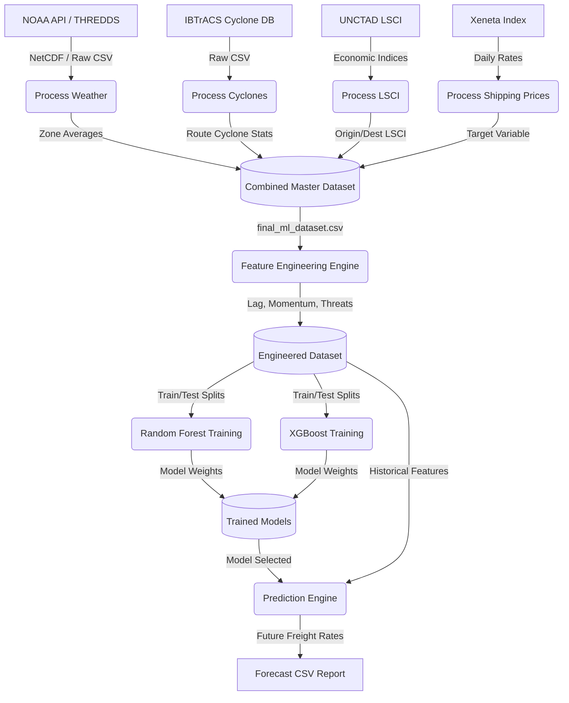
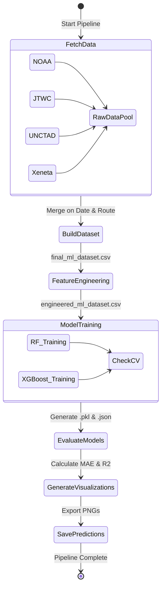

# 🌊 Maritime Route Cost Forecaster

[](https://www.python.org/)
[](https://xgboost.readthedocs.io/)
[](https://fastapi.tiangolo.com/)
[](https://www.sqlite.org/)
[](#website-dashboard)

An end-to-end Machine Learning pipeline and real-time streaming dashboard designed to predict container shipping freight rates (**USD/FEU**) across **4 major global trade routes**. By fusing heterogeneous environmental, economic, and historical market data, the system predicts freight rate fluctuations with exceptional accuracy.

---

## 📌 Table of Contents
1. [System Overview](#-system-overview)
2. [Architecture Diagrams](#-architecture-diagrams)
3. [Heterogeneous Data Sources](#-heterogeneous-data-sources)
4. [Feature Engineering Pipeline](#-feature-engineering-pipeline)
5. [Model Evaluation & Performance](#-model-evaluation--performance)
6. [Repository Structure](#-repository-structure)
7. [Installation & Setup](#%EF%B8%8F-installation--setup)
8. [Running the Visualization Dashboard](#-running-the-visualization-dashboard)

---

## 🌊 System Overview

The maritime shipping industry is subject to extreme pricing volatility driven by weather disruptions, regional economic connectivity shifts, and market momentum. This project integrates:
* **Heterogeneous Data Fusion:** Combines raw daily container shipping indices (Xeneta) with atmospheric grids (NOAA), tropical cyclone databases (IBTrACS), and port connectivity indicators (UNCTAD LSCI).
* **Geospatial Processing:** Vectorized mapping of coordinate-based atmospheric weather data to **9 distinct maritime transit zones**.
* **Systematic ML Sweeps:** Evaluated **160 models** across Random Forest and XGBoost architectures, employing varied training splits and hyperparameter combinations.
* **Real-Time Forecasting Simulator:** Uses Server-Sent Events (SSE) and a background streamer to update an SQLite historical store and display predictions on an aesthetic, terminal-inspired frontend.

---

## 📊 Architecture Diagrams

### 1. Data-Flow Diagram (DFD)
This diagram illustrates how raw inputs from external platforms are transformed, combined, and engineered into the final model predictions.



### 2. Pipeline Execution Sequence (Activity Diagram)
The step-by-step workflow followed by the system when the automation pipeline script `run_pipeline.py` is executed.



### 3. Use Case Diagram
Describes the user roles and functional boundaries of the system.

```mermaid
usecaseDiagram
    actor "Developer / Researcher" as User

    package "Maritime Route Forecaster System" {
        usecase "Fetch External Data (NOAA, LSCI, Xeneta)" as UC1
        usecase "Aggregate Weather Zones" as UC2
        usecase "Engineer Predictive Features" as UC3
        usecase "Train ML Models (RF, XGB)" as UC4
        usecase "Evaluate Model Accuracy" as UC5
        usecase "Generate Future Price Forecast" as UC6
        usecase "View Visualization Dashboard" as UC7
    }

    User --> UC1
    User --> UC2
    User --> UC3
    User --> UC4
    User --> UC5
    User --> UC6
    User --> UC7
```

---

## 📡 Heterogeneous Data Sources

The accuracy of this forecaster relies on merging distinct, highly relevant data streams:
1. **Xeneta Shipping Index:** Daily spot rates and contract rates in USD/FEU representing the benchmark cost.
2. **NOAA Atmospheric Grids:** Vectorized wind vectors (`u-wind`, `v-wind`), precipitation, sea surface temperatures, and pressure levels.
3. **IBTrACS/JTWC Cyclones:** Raw tracks containing cyclone wind speeds, central pressures, and proximity features indicating environmental disruption risk.
4. **UNCTAD LSCI:** The Liner Shipping Connectivity Index, mapping origin and destination port infrastructure strengths to capture trade volume capacity.

---

## ⚙️ Feature Engineering Pipeline

Raw coordinate data is converted into **50+ robust features** using vectorized Pandas/xarray operations:
* **Geospatial Zone Mappings:** Translates unstructured grid points into 9 critical global shipping corridors:
  * *North Atlantic, South Atlantic, Arabian Sea, Indian Ocean, South China Sea, East China Sea, Philippine Sea, North Pacific, and South Pacific.*
* **Historical Lag Features:** Implements 7-day, 14-day, and 30-day temporal lag offsets to capture historical price levels.
* **Momentum Indication:** Rolling averages, dynamic moving standards, rate of change, and momentum vectors.
* **Environmental Threat Metrics:** Dynamic `Coastal_Threat` coefficients derived from cyclone track projections and active atmospheric hazards.

---

## 🏆 Model Evaluation & Performance

A rigorous cross-validation and hyperparameter sweep was executed across **160 configurations** comparing Random Forest and XGBoost architectures. 

### Performance Summary
The **XGBoost** model trained on an **80/20 train/test split** emerged as the state-of-the-art configuration for production deployment.

| Model Architecture | Split Ratio | Mean Absolute Error (MAE) | Coefficient of Determination ($R^2$) |
| :--- | :---: | :---: | :---: |
| **XGBoost (Best)** | **80/20** | **$217.40** | **0.962** |
| Random Forest | 80/20 | $228.15 | 0.957 |
| XGBoost | 60/40 | $245.90 | 0.949 |
| Random Forest (Holdout) | 80/20 | $224.30 | **0.964** |

### Selected Production Model
* **Path:** `selectedmodel/xgb_80_20_lr001_depth5.json`
* **Configuration:** XGBoost, Max Depth = 5, Learning Rate = 0.01, Split = 80/20.

---

## 📂 Repository Structure

```bash
├── README.md               # Extensive project overview & instructions
├── .gitignore              # Multi-stage ignore parameters (prevents heavy CSV commits)
├── Analysis/               # Inter-feature correlations and data structure maps
├── EDA/                    # Exploratory Data Analysis notebooks & target distribution checks
├── ML Models/              # Codebase for training and pipeline execution
│   ├── run_pipeline.py     # Automated execution wrapper for model evaluation
│   ├── feature_engineering.py  # Script containing feature transforms
│   ├── year_based_split.py # Evaluation split algorithms
│   ├── Testing/            # Model performance tests
│   └── Visualization/      # Generated plots and evaluation curves
├── internship/             # System Analysis reports, diagrams, and developer notes
├── operational costs/      # Fetchers & parsers for UNCTAD economic indicators
├── new dataset/            # Data preparation pipeline
│   ├── build_dataset.py    # Spatial merging, cleaning, and route alignment
│   ├── clean_and_engineer.py # Feature extraction logic
│   ├── process_weather.py  # NOAA meteorological coordinate parser
│   ├── final_ml_dataset.csv # Consolidated master dataset
│   └── engineered_ml_dataset.csv # Post-feature engineered training-ready dataset
├── selectedmodel/          # Best-performing serialization weights
│   └── xgb_80_20_lr001_depth5.json
└── website/                # Predictive Visualization Application
    ├── start.bat           # Script to initialize backend, frontend, & streamer simultaneously
    ├── route_performance.py # Performance graphing helpers
    ├── route_stats.py      # Meta route stat helpers
    ├── test_api.py         # Diagnostic suite for FastAPI endpoints
    ├── test_stream.py      # Diagnostic suite for Server-Sent Events
    ├── backend/            # FastAPI Predictive API
    │   ├── app.py          # Backend initialization & database router
    │   ├── predictor.py    # Price forecast pipeline using selectedmodel
    │   └── requirements.txt # Python package requirements for backend
    ├── frontend/           # CSS-Glassmorphism Dashboard Interface
    │   ├── index.html      # HTML skeleton & ChartJS canvases
    │   ├── style.css       # Sleek terminal-inspired styling
    │   └── app.js          # Controller orchestrating API calls, SSE, and charts
    └── streaming/          # Mock Market Tick Streamer
        └── streamer.py     # Stream generator and database updater
```

---

## 🛠️ Installation & Setup

Ensure you have **Python 3.8+** and **SQLite** installed.

### 1. Clone the Repository
```bash
git clone https://github.com/aztecs666/internproj.git
cd internproj
```

### 2. Setup and Install Backend Dependencies
Create a virtual environment and install the required modules:
```bash
# Navigate to the backend directory
cd website/backend

# Create and activate virtual environment
python -m venv venv
# On Windows
venv\Scripts\activate
# On macOS/Linux
source venv/bin/activate

# Install requirements
pip install -r requirements.txt
```

---

## 🖥️ Running the Visualization Dashboard

To run the complete interactive suite (FastAPI Backend, Mock Streamer, and local HTTP server), you can launch them all with a single execution!

### Using the Automated Startup Script (Windows)
Navigate to the `website` directory and run the helper batch script:
```bash
cd website
start.bat
```
This script will:
1. Start the **FastAPI Web Server** at `http://127.0.0.1:8000`.
2. Start the **Data Streamer** in the background, updating historical records.
3. Automatically serve the **Frontend Web Console** on your browser.

---

### Manual Launch (Step-by-Step)
If you prefer running services manually, open separate terminal windows and run:

1. **Activate the FastAPI Backend:**
   ```bash
   cd website/backend
   python app.py
   ```
   *(Runs on `http://127.0.0.1:8000`)*

2. **Trigger the Real-Time Stream Engine:**
   ```bash
   cd website/streaming
   python streamer.py
   ```

3. **Serve the UI Web Dashboard:**
   Use any simple HTTP server in the `website/frontend` folder:
   ```bash
   cd website/frontend
   python -m http.server 8080
   ```
   Now open your browser and navigate to `http://localhost:8080` to see the live Glassmorphic Maritime Predictive Dashboard in action!
