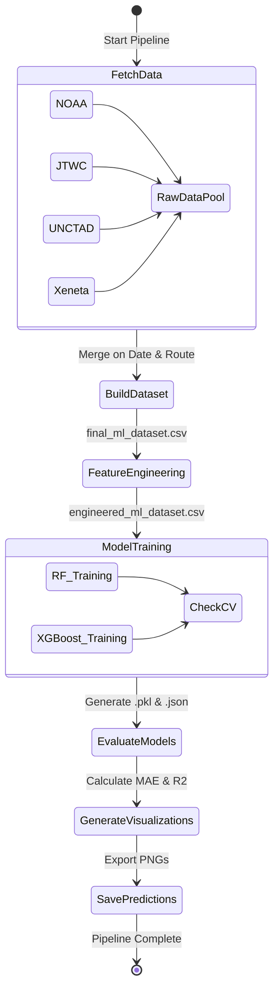
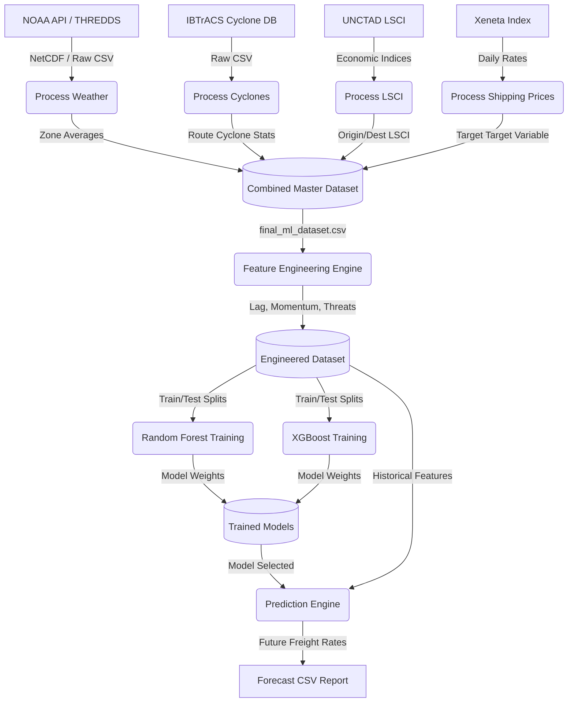

# 3. System Analysis

## 3.1 System Overview
The Maritime Route Cost Forecaster is an end-to-end Machine Learning pipeline designed to predict container shipping freight rates (USD/FEU) across major global trade routes. The system works by systematically ingesting and fusing heterogeneous data streams, including atmospheric weather from NOAA, tropical cyclone data from IBTrACS, economic connectivity indices from UNCTAD (LSCI), and baseline shipping rates from Xeneta. The core of the system is its powerful feature engineering engine, which translates raw environmental and economic metrics into predictive features. These features are then fed into robust ensemble models (Random Forest and XGBoost) to forecast future pricing, allowing stakeholders to anticipate logistical costs effectively.

## 3.2 Types of Users
Since this is an internship research project, the system is designed for a single type of user:
1. **Developer / Researcher:** Interacts with the core pipeline to fetch data, engineer features, run hyperparameter sweeps, evaluate model performance metrics, and generate price forecasts. The user runs the Python scripts locally to manage the entire end-to-end process.

## 3.3 Software Process Model
The system utilizes the **CRISP-DM (Cross-Industry Standard Process for Data Mining)** coupled with an **Iterative and Incremental Development** methodology. 
* **Iterative:** The feature engineering process continually loops, testing new hypotheses (e.g., aggregating weather over 9 specific ocean zones, testing lagged windows of 7/14/30 days).
* **Incremental:** New data sources (like Copernicus wave data) and models can be integrated into the architecture seamlessly without disrupting the core pipeline.

## 3.4 Functional Requirements
* **Data Ingestion:** The system must programmatically fetch historical weather (NOAA), cyclone (JTWC/IBTrACS), and economic data (UNCTAD LSCI).
* **Geospatial Aggregation:** The system must map raw latitude and longitude grid points to 9 predefined ocean zones (e.g., Arabian Sea, North Atlantic).
* **Feature Engineering:** The system must calculate dynamic features such as rolling averages, price lags, momentum, and weather hazard indices (e.g., `Coastal_Threat`).
* **Model Training:** The system must train both Random Forest and XGBoost algorithms across multiple predefined time-series data splits (80/20, 60/40, etc.).
* **Prediction Generation:** The system must be able to generate future price predictions based on historical feature inputs and save them in a structured format.
* **Evaluation & Visualization:** The system must evaluate model accuracy (MAE, R²) and generate performance comparison visualizations automatically.

## 3.5 Non-Functional Requirements
* **Performance:** The data ingestion and aggregation steps (handling millions of grid points) must be optimized using vectorized Pandas/xarray operations to complete within a reasonable timeframe.
* **Scalability:** The architecture must allow the seamless addition of new trade routes or new weather variables without a complete system overhaul.
* **Maintainability:** Code must be modularized into discrete scripts (e.g., `build_dataset.py`, `feature_engineering.py`, `train_xgb.py`) to allow independent updates and debugging.
* **Robustness & Reliability:** The pipeline must handle missing data points (NaNs) gracefully, utilizing forward-filling and strategic zero-imputation where appropriate.

---

## 3.6 UseCase Diagram

```mermaid
usecaseDiagram
    actor "Developer / Researcher" as User

    package "Maritime Route Forecaster System" {
        usecase "Fetch External Data (NOAA, LSCI, Xeneta)" as UC1
        usecase "Aggregate Weather Zones" as UC2
        usecase "Engineer Predictive Features" as UC3
        usecase "Train ML Models (RF, XGB)" as UC4
        usecase "Evaluate Model Accuracy" as UC5
        usecase "Generate Future Price Forecast" as UC6
        usecase "View Visualization Dashboard" as UC7
    }

    User --> UC1
    User --> UC2
    User --> UC3
    User --> UC4
    User --> UC5
    User --> UC6
    User --> UC7
```

---

## 3.7 Activity Diagram
This diagram illustrates the step-by-step sequential flow of the entire ML pipeline when `run_pipeline.py` is executed.



---

## 3.8 Data-Flow Diagram
This diagram highlights how raw data inputs are transformed into the final predictions through various system processes.


