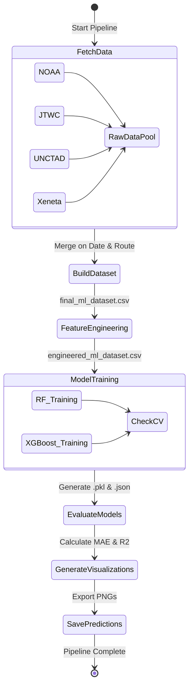

# Activity Diagram

This diagram illustrates the step-by-step sequential flow of the entire ML pipeline when `run_pipeline.py` is executed.

```mermaid
stateDiagram-v2
    [*] --> FetchData: Start Pipeline
    
    state FetchData {
        direction LR
        NOAA --> RawDataPool
        JTWC --> RawDataPool
        UNCTAD --> RawDataPool
        Xeneta --> RawDataPool
    }
    
    FetchData --> BuildDataset: Merge on Date & Route
    BuildDataset --> FeatureEngineering: final_ml_dataset.csv
    FeatureEngineering --> ModelTraining: engineered_ml_dataset.csv
    
    state ModelTraining {
        direction LR
        RF_Training --> CheckCV
        XGBoost_Training --> CheckCV
    }
    
    ModelTraining --> EvaluateModels: Generate .pkl & .json
    EvaluateModels --> GenerateVisualizations: Calculate MAE & R2
    GenerateVisualizations --> SavePredictions: Export PNGs
    SavePredictions --> [*]: Pipeline Complete
```
