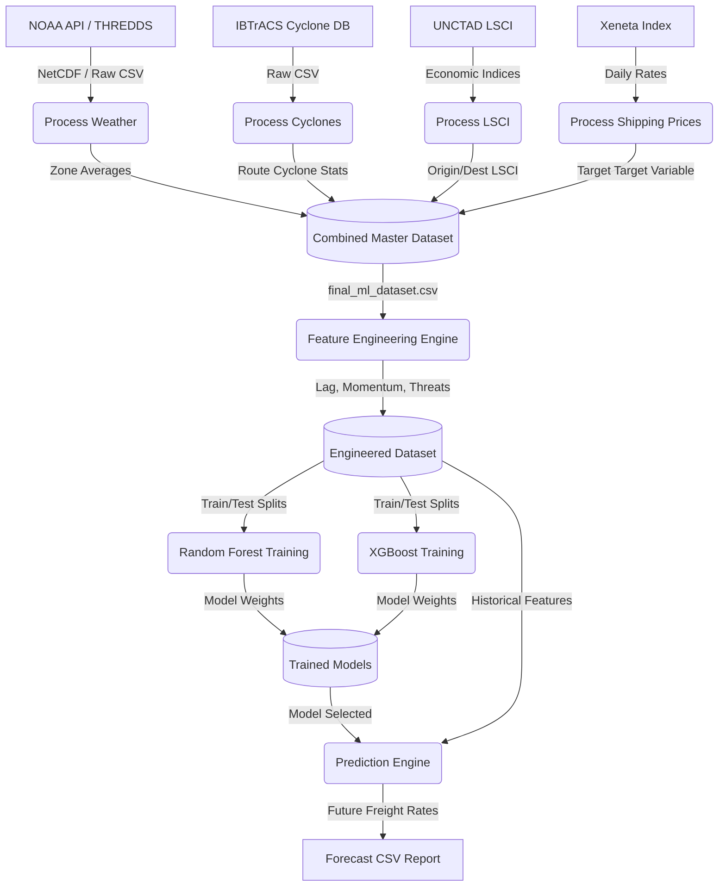

# Data-Flow Diagram

This diagram highlights how raw data inputs are transformed into the final predictions through various system processes.

```mermaid
graph TD
    %% External Data Entities
    E1[NOAA API / THREDDS] -->|NetCDF / Raw CSV| P1(Process Weather)
    E2[IBTrACS Cyclone DB] -->|Raw CSV| P2(Process Cyclones)
    E3[UNCTAD LSCI] -->|Economic Indices| P3(Process LSCI)
    E4[Xeneta Index] -->|Daily Rates| P4(Process Shipping Prices)

    %% Aggregation
    P1 -->|Zone Averages| D1[(Combined Master Dataset)]
    P2 -->|Route Cyclone Stats| D1
    P3 -->|Origin/Dest LSCI| D1
    P4 -->|Target Target Variable| D1

    %% Feature Engineering
    D1 -->|final_ml_dataset.csv| P5(Feature Engineering Engine)
    
    %% Intermediate DB
    P5 -->|Lag, Momentum, Threats| D2[(Engineered Dataset)]
    
    %% Machine Learning
    D2 -->|Train/Test Splits| P6(Random Forest Training)
    D2 -->|Train/Test Splits| P7(XGBoost Training)
    
    %% Output
    P6 -->|Model Weights| D3[(Trained Models)]
    P7 -->|Model Weights| D3
    
    D3 -->|Model Selected| P8(Prediction Engine)
    D2 -->|Historical Features| P8
    
    P8 -->|Future Freight Rates| O1[Forecast CSV Report]
```
