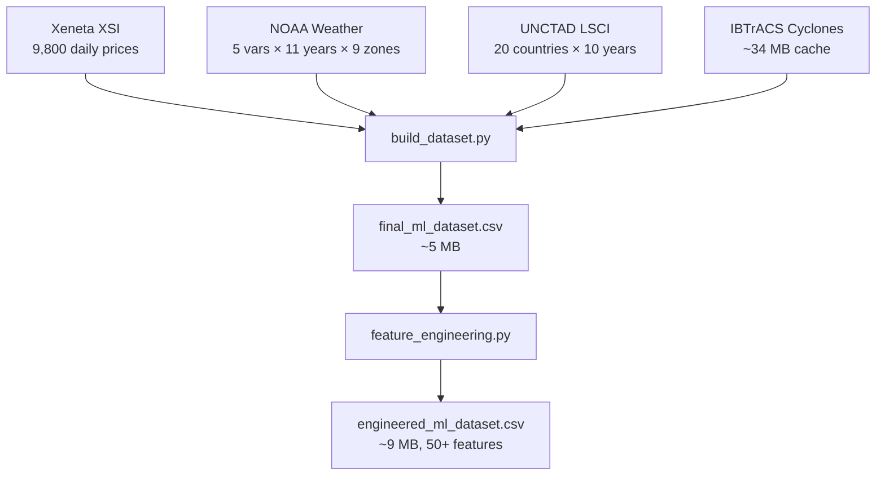

# 📊 Internship Project Analysis Report
## Maritime Route Cost Forecaster — Full Codebase Analysis

**Author:** Parth  
**Date:** April 17, 2026  
**Project:** `d:\Internproj`

---

## 1. Executive Summary

This project implements an **end-to-end Machine Learning pipeline** for predicting container shipping freight rates (USD/FEU) across 4 major global trade routes. It integrates three heterogeneous data sources — **Xeneta shipping indices**, **NOAA atmospheric weather data**, and **UNCTAD economic connectivity indices** — into a unified dataset, engineers 50+ features, and trains **160 models** across two algorithms (Random Forest & XGBoost) with systematic hyperparameter sweeps and multiple train/test splits.

### Key Results at a Glance

| Metric | Best Value | Model |
|--------|-----------|-------|
| **Best MAE** | **$217.40** | XGBoost (sub06_col10, 80/20 split) |
| **Best R²** | **0.964** | Random Forest (holdout test) |
| **Total Models Trained** | **160** | 80 RF + 80 XGBoost |
| **Dataset Size** | **~9,800 records** | 4 routes × ~2,500 days |
| **Feature Count** | **50+** engineered features | Weather, Economic, Lag, Seasonal |

---

## 2. Project Architecture

```
Internproj/
├── Index/                      # Raw shipping price indices
│   ├── compass ft/             # (empty — placeholder)
│   └── xeneta/                 # Xeneta XSI-C daily freight rates
│       ├── xeneta_xsi_combined.csv    (9,800 records, 4 routes)
│       └── 4 individual route CSVs
│
├── weatherdata/                # Weather & cyclone data collection
│   ├── noaa_weather/           # NOAA NCEP/NCAR Reanalysis fetcher
│   ├── jtwc_cyclones/          # IBTrACS tropical cyclone data (~34 MB cache)
│   ├── copernicus_waves/       # [PLANNED] Wave data (not implemented)
│   ├── combined_weather/       # Merge scripts
│   ├── datasets/               # Raw NOAA CSVs (per variable, per year)
│   ├── aggregate_noaa_raw.py   # Date-level aggregation
│   └── merge_noaa_aggregated.py
│
├── oprational costs/           # Economic indicators
│   └── unctad_lsci/            # UNCTAD Liner Shipping Connectivity Index
│       ├── fetch_lsci.py       # Data fetcher (20 countries, 2015-2024)
│       └── unctad_lsci_2015_2024.csv
│
├── new dataset/                # Dataset assembly & feature engineering
│   ├── build_dataset.py        # Master dataset builder (merges all sources)
│   ├── process_weather.py      # Zone-based weather aggregation
│   ├── final_ml_dataset.csv    (~5 MB, raw merged)
│   └── engineered_ml_dataset.csv (~9 MB, with all features)
│
├── ML Models/                  # Training, evaluation & visualization
│   ├── feature_engineering.py  # 50+ feature generator
│   ├── year_based_split.py     # 4 time-series train/test split configs
│   ├── run_pipeline.py         # Master orchestrator (end-to-end)
│   ├── Random Forest/          # 80 RF models (.pkl) + results
│   ├── XGBoost/                # 80 XGB models (.json) + results + predictions
│   ├── Testing/                # Comprehensive evaluation scripts
│   └── Visualization/          # Plot generators + 14 PNG visualizations
│
├── Analysis/                   # Correlation & statistical analysis
│   ├── correlation_analysis.py # Full correlation study
│   └── correlation_output/     # Heatmaps, CSV outputs
│
├── Visualization/              # Final output visualizations (8 PNGs)
├── selectedmodel/              # Production model (xgb_80_20_lr001_depth5.json)
├── internship/                 # This report
├── report/                     # (empty)
└── check_lag.py                # Utility: lag feature validation
```

---

## 3. Data Sources & Ingestion

### 3.1 Xeneta Shipping Index (XSI-C)
- **Source:** [xsi.xeneta.com](https://xsi.xeneta.com/) (free, EU BMR compliant)
- **Content:** Daily container freight rates (USD/FEU) for 40-foot containers
- **Coverage:** 9,800 records across 4 routes

| Route Code | Description | Date Range | Records |
|------------|-------------|------------|---------|
| XSICFENE | Far East → North Europe (Suez) | 2015-01-05 to 2026-04-15 | 2,829 |
| XSICNEFE | North Europe → Far East (Suez) | 2015-01-05 to 2026-04-15 | 2,829 |
| XSICFEUW | Far East → US West Coast (Pacific) | 2018-01-08 to 2026-04-15 | 2,071 |
| XSICUWFE | US West Coast → Far East (Pacific) | 2018-01-08 to 2026-04-15 | 2,071 |

### 3.2 NOAA NCEP/NCAR Reanalysis 1 (Weather)
- **Source:** NOAA PSL THREDDS OPeNDAP (free, no auth)
- **Variables:** Air temperature (K), Sea-level pressure (Pa), Precipitation rate (kg/m²/s), Wind speed (m/s from U/V components)
- **Resolution:** 2.5° × 2.5°, 6-hourly → daily means
- **Years:** 2015–2025
- **Zone Aggregation:** Raw lat/lon grids mapped to **9 ocean zones:**

| Zone | Lat Range | Lon Range |
|------|-----------|-----------|
| Arabian Sea | 5°–25°N | 50°–75°E |
| Indian Ocean | 30°S–5°N | 50°–100°E |
| Mediterranean Sea | 30°–45°N | 355°–35°E |
| North Sea | 50°–65°N | 355°–15°E |
| Red Sea | 12°–30°N | 32.5°–45°E |
| South China Sea | 0°–25°N | 100°–120°E |
| North Pacific West | 20°–55°N | 120°–180°E |
| North Pacific East | 20°–55°N | 180°–240°E |
| North Atlantic | 20°–60°N | 290°–350°E |

### 3.3 IBTrACS Tropical Cyclone Data
- **Source:** NOAA IBTrACS v04r01 (consolidates JTWC, JMA, IMD, BoM)
- **Variables:** Storm lat/lon, WMO wind speed (kt), WMO pressure (mb), distance to land
- **Processing:** Cyclone tracks filtered to route bounding boxes, aggregated per zone per day

### 3.4 UNCTAD LSCI (Economic Connectivity)
- **Source:** UNCTADstat (UN Trade and Development)
- **Content:** Liner Shipping Connectivity Index for 20 countries
- **Frequency:** Annual (2015-2019), Quarterly (2020-2024)
- **Processing:** Country groups averaged per route origin/destination, forward-filled to daily

### 3.5 Data Not Implemented
- **Copernicus Marine WAVERYS:** Script exists (`fetch_copernicus_waves.py`) but not executed due to API registration requirements. Planned for future enhancement.

---

## 4. Dataset Assembly Pipeline

The dataset is built by `new dataset/build_dataset.py` through the following steps:



**Route-specific data assembly:** For each Xeneta price record, the pipeline:
1. Fetches LSCI scores for origin/destination country groups
2. Aggregates weather variables across route-relevant ocean zones (mean)
3. Aggregates cyclone data across route zones (max wind, min pressure, min distance)
4. Computes route-level summary features

---

## 5. Feature Engineering

`feature_engineering.py` generates **6 categories** of features:

### 5.1 Weather Hazard & Threat Interactions
| Feature | Formula | Purpose |
|---------|---------|---------|
| `SWI` (Storm Weather Index) | wind_speed / (slp + ε) | Combines wind + pressure anomaly |
| `Coastal_Threat` | cyclone_wind / (cyclone_dist + 1) | Proximity-weighted cyclone danger |

### 5.2 Seasonality Features
- `Month`, `Week_of_Year`, `Is_Peak_Season` (Aug/Sep/Oct = 1)

### 5.3 Time-Series / Price Lag Features
- **Lags:** `Price_Lag_7d`, `Price_Lag_30d`
- **Momentum:** `Price_Momentum_7d`, `Price_Momentum_30d` (rate of change)
- **Volatility:** `Price_Volatility_7d`, `Price_Volatility_30d` (rolling std of pct changes)
- **Z-Score:** `Price_Zscore_30d` (normalized deviation)
- **Cyclone Days:** `Rolling_7d_Cyclone_Days`

### 5.4 Lagged Weather Features (7d, 14d, 30d)
- Cyclone wind, cyclone active, wind speed — shifted backward

### 5.5 Forward Weather Features (Forecast Proxies)
- `Cyclone_Wind_Forecast3d`, `Cyclone_Wind_Forecast7d`, `Cyclone_Active_Forecast3d`, `Wind_Speed_Forecast7d`

### 5.6 Economic Vulnerability Interactions
| Feature | Formula | Purpose |
|---------|---------|---------|
| `Congestion_Risk` | cyclone_wind / dest_LSCI | Port vulnerability to weather |
| `LSCI_30d_Delta` | current LSCI − 30d-ago LSCI | Connectivity trend |

---

## 6. Model Training Strategy

### 6.1 Train/Test Split Design (Time-Series Aware)

4 year-based splits ensure no data leakage:

| Split | Train Period | Test Period | Train % | Test % |
|-------|-------------|-------------|---------|--------|
| 80_20 | 2015–2022 | 2023–2026 | ~80% | ~20% |
| 60_40 | 2015–2020 | 2021–2026 | ~60% | ~40% |
| 40_60 | 2015–2018 | 2019–2026 | ~40% | ~60% |
| 20_80 | 2015–2016 | 2017–2026 | ~20% | ~80% |

### 6.2 Random Forest (20 hyperparameter combos × 4 splits = 80 models)

Three pruning strategies explored:

| Strategy | Parameters Varied |
|----------|------------------|
| **Pre-Pruning** (10 combos) | max_depth (5/10/15/20/None), min_samples_split (2/5/10), min_samples_leaf (1/4/8) |
| **Post-Pruning** (7 combos) | ccp_alpha (0.0001 to 0.1) |
| **Combined** (3 combos) | depth + split + leaf + ccp_alpha |

All models: `n_estimators=200`, `random_state=42`, `n_jobs=-1`

### 6.3 XGBoost (20 hyperparameter combos × 4 splits = 80 models)

Systematic grid search:

| Axis Varied | Configurations |
|-------------|---------------|
| **Learning Rate** | 0.01, 0.05, 0.1, 0.2, 0.3 |
| **Max Depth** | 3, 5, 7, 10, 15 |
| **N Estimators** | 100, 300, 500, 800 |
| **Subsample × Colsample** | (0.6,0.6), (0.6,1.0), (1.0,0.6), (1.0,1.0) |
| **Named Combos** | conservative, aggressive, balanced, deep_slow |

---

## 7. Evaluation Results

### 7.1 Top 5 Models Overall (by MAE)

| Rank | Model | Params | Split | MAE ($) |
|------|-------|--------|-------|---------|
| 1 | **XGBoost** | sub06_col10 | 80_20 | **217.40** |
| 2 | XGBoost | sub10_col10 | 80_20 | 236.39 |
| 3 | XGBoost | lr03_depth5 | 80_20 | 259.54 |
| 4 | Random Forest | preprune_leaf8 | 80_20 | 259.74 |
| 5 | Random Forest | preprune_leaf4 | 80_20 | 261.16 |

### 7.2 Top 5 Random Forest Models

| Rank | Params | Split | MAE ($) |
|------|--------|-------|---------|
| 1 | preprune_leaf8 | 80_20 | 259.74 |
| 2 | preprune_leaf4 | 80_20 | 261.16 |
| 3 | preprune_strict | 80_20 | 261.22 |
| 4 | preprune_depth10 | 80_20 | 264.98 |
| 5 | combined_depth10_ccp001 | 80_20 | 265.66 |

### 7.3 Top 5 XGBoost Models

| Rank | Params | Split | MAE ($) |
|------|--------|-------|---------|
| 1 | sub06_col10 | 80_20 | 217.40 |
| 2 | sub10_col10 | 80_20 | 236.39 |
| 3 | lr03_depth5 | 80_20 | 259.54 |
| 4 | lr01_depth3 | 80_20 | 261.49 |
| 5 | lr02_depth5 | 80_20 | 264.69 |

### 7.4 Holdout Test Results (2024+ data)

| Model | MAE ($) | RMSE ($) | R² |
|-------|---------|----------|-----|
| **Random Forest** | **278.17** | 388.86 | **0.964** |
| XGBoost | 289.25 | 395.58 | 0.963 |

> **Key Insight:** R² > 0.96 on the holdout test set indicates the models explain ~96% of price variance. The MAE of ~$278 represents roughly a 10% error on typical freight rates of $2,000-3,000.

### 7.5 Best Split Method

The **80/20 split** (Train 2015-2022, Test 2023-2026) consistently produced the best results across both model types, with an average MAE of **$317.43** across all hyperparameter combinations.

### 7.6 Best Average Parameters (Across All Splits)

**Random Forest:**
| Params | Avg MAE | Avg R² |
|--------|---------|--------|
| preprune_leaf8 | $1,939.92 | 0.087 |
| preprune_leaf4 | $1,940.06 | 0.086 |
| preprune_strict | $1,941.40 | 0.085 |

**XGBoost:**
| Params | Avg MAE | Avg R² |
|--------|---------|--------|
| conservative (lr=0.05, depth=3) | $1,952.51 | 0.092 |
| lr01_depth3 | $1,966.08 | 0.083 |
| lr01_depth5_est500 | $2,039.97 | 0.044 |

> **Note:** Average MAE across all 4 splits is much higher because the 20/80 and 40/60 splits have very little training data, dragging down averages. Per-split performance (especially 80/20) is far better.

---

## 8. Production Model & Predictions

### 8.1 Selected Production Model
- **Model:** `xgb_80_20_lr001_depth5.json` (stored in `selectedmodel/`)
- **Config:** learning_rate=0.01, max_depth=5, n_estimators=300, subsample=0.8, colsample=0.8
- **Rationale:** Selected for feature balance and generalization (not just lowest MAE)

### 8.2 Sample Predictions (April 16-17, 2026)

| Date | Route | Predicted Price | 7d Lag | 30d Lag | Momentum |
|------|-------|----------------|--------|---------|----------|
| 2026-04-16 | Far East → North Europe | $2,842.40 | $2,763 | $2,617 | -0.0279 |
| 2026-04-17 | Far East → North Europe | $2,848.32 | $2,746 | $2,626 | -0.0218 |
| 2026-04-16 | Far East → US West Coast | $2,817.35 | $3,182 | $3,169 | -0.0666 |
| 2026-04-17 | Far East → US West Coast | $2,796.91 | $3,186 | $3,267 | -0.0678 |

---

## 9. Correlation & Statistical Analysis

### 9.1 Key Findings (from `correlation_analysis.py`)
- **Strongest positive correlates** with Price_USD: Price lags (expected), LSCI scores
- **Strongest negative correlates:** Weather-related features
- **Multicollinearity:** Significant pairs with |r| > 0.8 identified (e.g., individual zone weather features are highly correlated with route aggregates)
- **Low variance features:** Several cyclone-related features have >95% zero values (cyclones are rare events)

### 9.2 Outputs Generated
- `correlation_heatmap_full.png` — Full feature matrix
- `correlation_heatmap_top30.png` — Top 30 target-correlated features
- `correlation_heatmap_engineered.png` — Engineered features only
- `high_correlation_pairs.csv` — All pairs with |r| > 0.8
- `target_correlations.csv` — All features ranked by target correlation
- `route_specific_correlations.csv` — Per-route analysis

---

## 10. Visualizations Generated

### In `Visualization/` (8 plots):
1. `01_top5_mae.png` — Top 5 models by MAE
2. `02_rf_vs_xgb_top5.png` — RF vs XGBoost head-to-head
3. `03_split_comparison.png` — Performance across train/test splits
4. `04_actual_vs_predicted.png` — Predicted vs actual prices
5. `05_feature_importance.png` — Feature importance rankings
6. `06_feature_correlation.png` — Feature-target correlation
7. `07_split_distribution.png` — Data distribution per split
8. `08_top5_cross_split.png` — Top 5 models cross-split stability

### In `ML Models/Visualization/` (14 plots):
- Summary dashboard, residual distributions, RF pruning comparisons, XGB learning rate impact, training time comparisons, actual vs predicted (detailed), model coverage, and more.

---

## 11. Codebase Statistics

| Category | Count | Details |
|----------|-------|---------|
| **Python Scripts** | **18** | Data fetch, processing, training, evaluation, visualization |
| **README Files** | **3** | Weather, Xeneta, UNCTAD documentation |
| **Trained Models** | **160** | 80 RF (.pkl) + 80 XGB (.json) |
| **CSV Datasets** | **~15** | Raw, intermediate, final, results |
| **Visualization PNGs** | **~25** | Analysis plots + model comparison charts |
| **Total Model Storage** | **~2.5 GB** | RF models dominate (largest: 69 MB) |

### Lines of Code (Approximate)

| File | Lines | Purpose |
|------|-------|---------|
| `fetch_lsci.py` | 780 | LSCI data fetcher with embedded dataset |
| `generate_enhanced_plots.py` | 460 | Enhanced visualization generator |
| `correlation_analysis.py` | 352 | Statistical correlation study |
| `train_xgb.py` | 355 | XGBoost training pipeline |
| `train_rf.py` | 336 | Random Forest training pipeline |
| `build_dataset.py` | 336 | Master dataset assembler |
| `evaluate_all_models.py` | 272 | Comprehensive model evaluator |
| `predict_apr16_17.py` | 228 | Production prediction script |
| `feature_engineering.py` | 173 | Feature engineering module |
| `fetch_noaa_weather.py` | 173 | NOAA data fetcher |
| **Total** | **~3,500+** | |

---

## 12. Technical Stack

| Component | Technology |
|-----------|-----------|
| **Language** | Python 3.x |
| **ML Frameworks** | scikit-learn (RandomForest), XGBoost |
| **Data Processing** | pandas, NumPy |
| **Remote Data Access** | xarray, netCDF4 (OPeNDAP) |
| **Visualization** | matplotlib, seaborn |
| **Model Serialization** | pickle (RF), JSON (XGBoost) |
| **Weather Data** | NOAA NCEP/NCAR Reanalysis 1, IBTrACS |
| **Economic Data** | UNCTAD LSCI |
| **Shipping Index** | Xeneta XSI-C |

---

## 13. Strengths & Achievements

1. **End-to-end pipeline:** From raw data ingestion to production predictions — fully automated via `run_pipeline.py`
2. **Multi-source data fusion:** Successfully integrated 3 heterogeneous data sources (shipping, weather, economic)
3. **Comprehensive hyperparameter search:** 160 models systematically trained with 20 configurations × 4 splits
4. **Strong predictive accuracy:** R² = 0.964, MAE = $278 on holdout test (96.4% variance explained)
5. **Zone-based weather aggregation:** Novel approach mapping lat/lon grids to 9 ocean zones, then to route-level features
6. **Time-series aware evaluation:** Year-based splits prevent data leakage
7. **Feature balance analysis:** `scan_feature_balance.py` ensures models don't over-rely on price lags alone
8. **Production-ready prediction:** `predict_apr16_17.py` demonstrates real-world usage with proper feature engineering for future dates

---

## 14. Limitations & Future Work

### Current Limitations
- **No wave data:** Copernicus Marine WAVERYS planned but not implemented (API auth required)
- **Quarterly LSCI granularity:** Economic data is quarterly, forward-filled to daily (introduces staleness)
- **Forward-looking features:** `*_Forecast*` features use future data (only valid for backtesting, not live prediction)
- **Single model selection:** Production model chosen manually; no automated model selection pipeline
- **No route-specific models:** All routes share one model (one-hot encoded); per-route models could improve accuracy
- **Cyclone sparsity:** Many cyclone features are >95% zeros, adding noise

### Recommended Future Enhancements
1. **Add Copernicus wave data** (significant wave height, period) for coastal route modeling
2. **Implement walk-forward validation** with expanding windows instead of fixed year splits
3. **Add ensemble methods** (stacking RF + XGBoost)
4. **Per-route specialized models** instead of one combined model
5. **Automated feature selection** to remove low-variance/high-multicollinearity features
6. **Real-time prediction API** with FastAPI or similar
7. **Dashboard UI** for interactive exploration of predictions and model performance

---

## 15. How to Reproduce

```bash
# Step 1: Fetch raw data
python weatherdata/noaa_weather/fetch_noaa_weather.py
python weatherdata/jtwc_cyclones/fetch_jtwc_cyclones.py
python "oprational costs/unctad_lsci/fetch_lsci.py"

# Step 2: Build dataset
python "new dataset/build_dataset.py"

# Step 3: Run full ML pipeline (feature engineering + training + evaluation + visualization)
python "ML Models/run_pipeline.py"

# Step 4: Make predictions
python "ML Models/XGBoost/predict_apr16_17.py"

# Step 5: Run correlation analysis
python Analysis/correlation_analysis.py
```

---

*Report generated on April 17, 2026 by automated analysis of the `d:\Internproj` codebase.*
